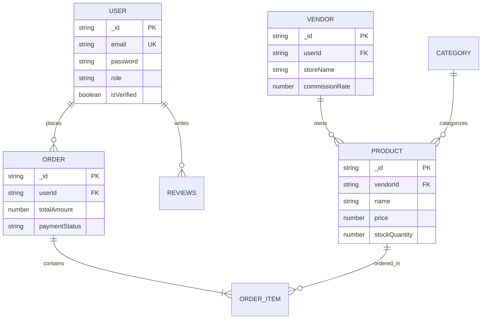

# Software Design Document (SDD)

## Project: Rainbow Fashions Enterprise E-Commerce SaaS

---

## 1. Architectural Strategy & Design Patterns
The application follows an **Enterprise Layered Architecture** with strict boundary isolation between presentation, business rules, and persistence:

1. **Controller Layer (`server/controllers/`)**: Responsible for decoding HTTP requests, invoking validation schemas, delegating to services, and returning standard JSON envelopes `{ success: true, data: ... }`.
2. **Service Layer (`server/services/`)**: Encapsulates core business rules (e.g., inventory deduction, commission payout splits, AI recommendations).
3. **Repository / Data Access Layer (`server/models/`)**: Mongoose Schemas providing data validation, indexing, virtual fields, and pre-save hooks.

---

## 2. Data Models & Entity-Relationship Design

---

## 3. Component Details & Security Controls
- **Rate Limiter:** Standard API limiter (`100 requests per 15 minutes`) and Auth limiter (`5 requests per 15 minutes`).
- **Data Encryption:** Passwords hashed with `bcryptjs` (salt rounds: 10). Sensitive tokens signed with HS256 algorithm.
